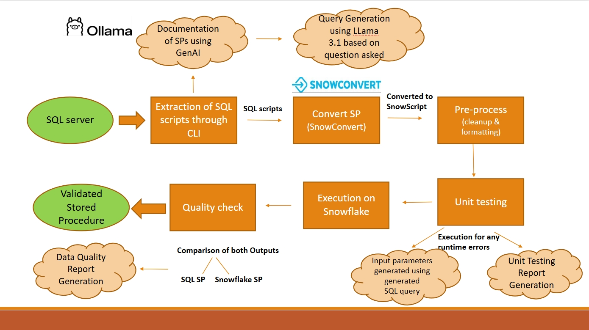
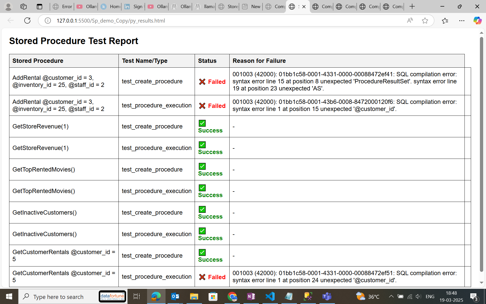

# Stored Procedure Migration Pipeline

## Overview

The **Migration Pipeline** provides a fully automated system for migrating SQL Server stored procedures to **Snowflake**, covering every critical step from script extraction to conversion, testing, and data quality validation. Designed for reliability and extensibility, this pipeline ensures a smooth transition between platforms with minimal manual intervention.

---
## Pipeline Architecture


---
## 🚀 Quick Start

1. **Clone the repo**  
   ```bash
   git clone https://github.com/shreya-pi/SP_Migration.git
   cd SP_Migration
   ```

2. **Build Docker image**

   ```bash
   docker build -t sp-migration-pipeline .
   ```
3. **Configure credentials**
   Update `config.py` (see **Configuration** below).

4. **Install Python dependencies**
   ```bash
   pip install -r requirements.txt
   ```
5. **Install SnowConvert CLI**
   See **SnowConvert Setup** below.
6. **Install Ollama & Llama 3.1**
   See **AI Layer Setup** below.
7. **Run the full pipeline**

   ```bash
   python main.py
   ```
---

## 📋 Prerequisites

* Python ≥ 3.9
* Docker (optional)
* PowerShell (for SQL Server scripter)
* ODBC Driver 17+ for SQL Server
* Access to Ollama (for local LLM execution)

---

## 🔧 SnowConvert CLI Setup

SnowConvert is the core engine that rewrites T-SQL into Snowflake SQL.

1. **Download & install**

   ```bash
   # macOS/Homebrew
   brew install snowconvert

   # Linux (deb)
   wget https://downloads.snowconvert.com/linux/snowconvert.deb
   sudo dpkg -i snowconvert.deb
   ```
2. **Verify installation**

   ```bash
   snowconvert --version
   ```
3. **Add to `$PATH`** (if needed)

   ```bash
   export PATH="$PATH:/path/to/snowconvert"
   ```

---

## 🤖 AI Layer Setup (Ollama + Llama 3.1)

We leverage Ollama to host and serve local LLMs. The `gen_ai_layer` folder contains custom Ollama model definitions.

1. **Install Ollama**

   ```bash
   # macOS (Homebrew)
   brew install ollama

   # Linux (Homebrew)
   brew install ollama

   # Or download from https://ollama.com/docs/installation
   ```
2. **Pull the base Llama 3.1 image**

   ```bash
   ollama pull llama:3.1
   ```
3. **Add your custom model files**
   In `gen_ai_layer/`:

   * `spapp_modelfile` — base image + finetuning for SP explanations
   * `sqapp_modelfile` — base image + finetuning for SQL query generation

   ```bash
   # Register SP-explanation model
   ollama import spapp --from-file gen_ai_layer/spapp_modelfile

   # Register SQL-generation model
   ollama import sqapp --from-file gen_ai_layer/sqapp_modelfile
   ```
4. **Run a quick test**

   ```bash
   # SP explanation
   ollama run spapp "Explain the dbo_GetCustomerRentals procedure."

   # SQL generation
   ollama run sqapp "Generate a SELECT query for all active customers."
   ```

---


## 🗂️ Project Structure

```
├── .dockerignore
├── .gitignore
├── config.py                     # All pipeline & DB connection settings
├── Dockerfile                    # Container image definition
├── documentation.txt             # High-level design notes and change log
├── main.py                       # Orchestrator: runs all stages in sequence
├── README.md                     # (this file)
├── requirements.txt              # Python dependencies
├── SP_final_pipeline.jpeg        # Workflow diagram
├── structure.py                  # Utility: auto-generate structure.txt
├── structure.txt                 # Static folder‐tree snapshot
│
├── converted_output/             # Raw & processed outputs
│   ├── Logs/                     # Stage logs
│   │   ├── GenericInfrastructureController/…
│   │   ├── GenericScanner/…
│   │   └── SnowConvert/…
│   ├── Output/                   # Converted Snowflake SQL scripts
│   └── Reports/                  # QA & assessment reports
│       ├── GenericScanner/…
│       └── SnowConvert/…
│
├── Dq_analysis/                  # Data-quality dashboards & diffs
│   ├── data_quality_report.html
│   ├── differences.csv
│   └── *.png/.json                # Supporting charts & raw data
│
├── gen_ai_layer/                 # AI-powered doc + test-case generators
│   ├── extract_schema.py         # Dump DB schema for AI ingestion
│   ├── generate_sp_exp.py        # Explain SP logic via LLM
│   ├── generate_sql_query.py     # Map plain-English → SQL
│   ├── generate_test_case.py     # Auto-create sample SP inputs
│   ├── schema.txt                # Sample schema for AI prompts
│   ├── spapp_modelfile           # Ollama model (SP explanations)
│   └── sqapp_modelfile           # Ollama model (SQL generation)
│
├── helper_scripts/               # Core conversion & testing utilities
│   ├── convert_scripts.py        # SnowConvert wrapper
│   ├── generate_scripts.py       # PowerShell → .sql extraction
│   ├── log.py                    # Logging helper
│   ├── process_sc_script.py      # Format & sanitize converted SQL
│   ├── py_test.py                # PyUnit SP functional tests
│   └── qt_test.py                # End-to-end SQL Server vs Snowflake diff
│
├── input_parameters_PyUnit/      # Sample inputs & helpers for PyUnit
│   ├── call_statements.json
│   ├── convert_schema_format.py
│   ├── execute_query.py
│   ├── filtered_schema.py
│   ├── generate_query.py
│   ├── main.py                   # PyUnit driver
│   ├── schema.txt
│   ├── sp_exp_1.json
│   └── requirements.txt          # If run standalone
│
├── logs/                         # Pipeline & conversion logs
│   ├── assessment_log.txt
│   ├── dq_logs.log
│   └── Sp_convertion.log
│
├── processed_output/             # Final cleaned SQL scripts
│   ├── processed_dbo_AddRental.sql
│   └── … (one per SP)
│
├── py_tests/                     # PyUnit test artifacts
│   ├── py_data.json
│   ├── py_results.html
│   └── SP_PyUnit_Output_dashboard.png
│
└── sql_output/                   # Baseline SQL outputs for comparison
    ├── Airbyte_demo_base/…
    └── staging_sakila/…
```

---

## Workflow Stages

### 1. **Generate SQL Scripts**
- **Tool**: `SQLServerScripter`
- **Function**: Extracts stored procedures from SQL Server using PowerShell automation.
- **Output**: Raw SQL scripts.
- **Script**: [`generate_scripts.py`](helper_scripts/generate_scripts.py)

### 2. **Convert SQL Scripts**
- **Tool**: `SnowConvertRunner`
- **Function**: Transforms extracted SQL into Snowflake-compatible scripts using SnowConvert.
- **Output**: Converted `.sql` files.
- **Script**: [`convert_scripts.py`](helper_scripts/convert_scripts.py)

### 3. **Process Converted Scripts**
- **Tool**: `ScScriptProcessor`
- **Function**: Cleans, formats, and prepares scripts for testing and deployment.
- **Output**: Finalized Snowflake-ready SQL.
- **Script**: [`process_sc_script.py`](helper_scripts/process_sc_script.py)

### 4. **Run Unit Tests**
- **Tool**: `TestStoredProcedure`
- **Function**: Validates converted procedures using PyUnit tests and sample inputs.
- **Output**: Pass/fail status for functional correctness.
- **Script**: [`py_test.py`](helper_scripts/py_test.py)

### 5. **Quality Assurance Testing**
- **Tool**: `DatabaseProcedureExecutor`
- **Function**: Compares execution results between SQL Server and Snowflake.
- **Output**: HTML report with detected data differences.
- **Script**: [`qt_test.py`](helper_scripts/qt_test.py)

### 6. **Run the Pipeline**
- **Command**: `python main.py`
- **Function**: Sequentially runs all stages of the migration process.

---

## Key Components

| Component                   | Responsibility                                           | Source Code                                      |
|----------------------------|-----------------------------------------------------------|--------------------------------------------------|
| `SQLServerScripter`         | Extract SQL Server procedures using PowerShell            | [generate_scripts.py](helper_scripts/generate_scripts.py) |
| `SnowConvertRunner`         | Apply SnowConvert transformation to SQL files             | [convert_scripts.py](helper_scripts/convert_scripts.py)   |
| `ScScriptProcessor`         | Sanitize and format Snowflake SQL for deployment          | [process_sc_script.py](helper_scripts/process_sc_script.py) |
| `TestStoredProcedure`       | Run unit tests on Snowflake scripts                       | [py_test.py](helper_scripts/py_test.py)         |
| `DatabaseProcedureExecutor` | Perform end-to-end validation and output comparison       | [qt_test.py](helper_scripts/qt_test.py)         |

---

## Configuration

Set the following variables in your config before executing the pipeline:

| Parameter               | Description                                           |
|------------------------|-------------------------------------------------------|
| `output_dir`           | Folder to save extracted SQL scripts                  |
| `input_path`           | Path to the folder with raw SQL scripts               |
| `converted_path`       | Directory to save Snowflake-compatible scripts        |
| `processed_input`      | Folder with scripts ready for testing                 |
| `processed_output`     | Destination folder for finalized scripts              |
| `schema_name` *(opt)*  | Target Snowflake schema (if applicable)               |
| `log_file`             | Path to save log output from pipeline execution       |
| `html_report_path`     | Location to store data quality comparison reports     |

---

## Usage

To execute the full migration pipeline, simply run:

```bash
python main.py
```

Ensure all configuration paths are correctly defined in your settings or script.


**Configure database connections**

   * Open `config.py` and provide connection details for both platforms.
   * Example (Snowflake):

     ```python
     SNOWFLAKE_CONFIG = {
         'user': 'YOUR_USER',
         'password': 'YOUR_PASSWORD',
         'account': 'YOUR_ACCOUNT',
         'warehouse': 'YOUR_WAREHOUSE',
         'database': 'MY_DB',
         'schema': 'MY_SCHEMA'
     }
     ```
   * Example (SQL Server):

     ```python
     SQL_SERVER_CONFIG = {
         'driver': '{ODBC Driver 17 for SQL Server}',
         'server': 'your_sql_server_host',
         'database': 'your_database',
         'username': 'your_username',
         'password': 'your_password'
     }
     ```

**Run only conversion stage**

```bash
python helper_scripts/convert_scripts.py \
  --input raw_sql/ --output converted_output/Output/SnowConvert
```

**Execute PyUnit tests**

```bash
python helper_scripts/py_test.py \
  --schema input_parameters_PyUnit/schema.txt \
  --calls input_parameters_PyUnit/call_statements.json
```

**Launch data-quality dashboard**

```bash
open Dq_analysis/data_quality_report.html
```

---

##  Folder Structure and Descriptions

### 📂 `Dq_analysis/`
- `data_quality_report.html` – HTML dashboard comparing output differences  
 
- `SP_name_differences.csv` – Differences found in stored procedure outputs  
- `dq_data.json` – Input JSON containing execution parameters  

### 📂 `gen_ai_layer/`
- `generate_sp_exp.py` – Documents the logic of stored procedures  
- `generate_sql_query.py` – Converts user queries to SQL  
- `generate_test_case.py` – Auto-generates test cases for stored procedures 
 
- `extract_schema.py` – Extracts DB schema metadata  
- `spapp_modelfile` – Ollama model file for stored procedure explanations  
- `sqapp_modelfile` – Ollama model file for SQL query generation  

### 📂 `input_parameters_PyUnit/`
- `convert_schema_format.py` – Schema formatting for AI query generation  
- `filtered_schema.py` – Filters schema to relevant segments  
- `generate_query.py` – Uses schema and input to generate queries  
- `execute_query.py` – Executes queries on SQL Server to fetch input values  
- `sp_exp_1.json` – Stored procedure explanation file  
- `call_statements.json` – Stored procedure call statements for testing  

### 📂 `py_tests/`
- `py_data.json` – Input parameters for PyUnit stored procedure testing  
- `py_results.html` – HTML dashboard with PyUnit test results  
 

---

## 💡 Best Practices

- Always back up your SQL Server procedures before migration.
- Test Snowflake scripts in a sandbox environment before production deployment.
- Customize `dq_data.json` and `py_data.json` to fine-tune your validation.
- Ensure consistent schema naming across SQL Server and Snowflake.
- Regularly update the SnowConvert CLI for latest syntax support.

---

## ✅ Final Notes

This pipeline offers a robust framework for SP migration from SQL Server to Snowflake with AI-assisted testing and validation. Modular components allow for easy debugging, reuse, and enhancement.

