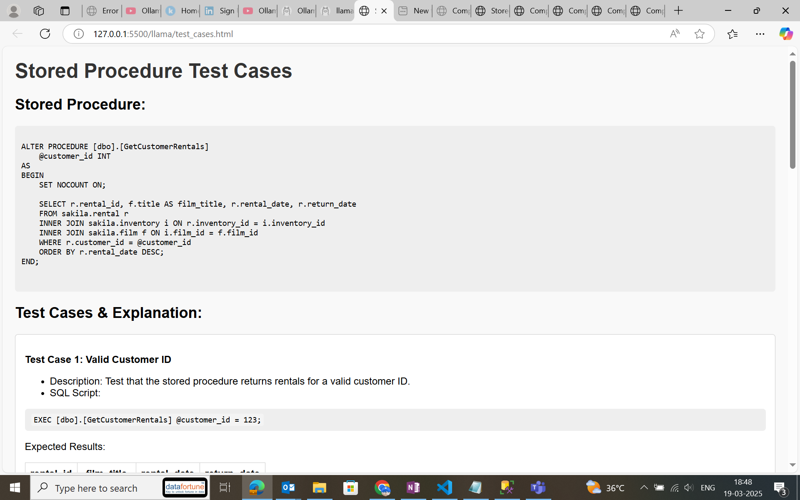

##  Folder Structure and Descriptions

### 📂 `gen_ai_layer/`
- `generate_sp_exp.py` – Documents the logic of stored procedures  
- `generate_sql_query.py` – Converts user queries to SQL  
- `generate_test_case.py` – Auto-generates test cases for stored procedures 
 
- `extract_schema.py` – Extracts DB schema metadata  
- `spapp_modelfile` – Ollama model file for stored procedure explanations  
- `sqapp_modelfile` – Ollama model file for SQL query generation  

## 🤖 AI Layer Setup (Ollama + Llama 3.1)

We leverage Ollama to host and serve local LLMs. The `gen_ai_layer` folder contains custom Ollama model definitions.

1. **Install Ollama**

   ```bash
   # macOS (Homebrew)
   brew install ollama

   # Linux (Homebrew)
   brew install ollama

   # Or download from https://ollama.com/docs/installation
   ```
2. **Pull the base Llama 3.1 image**

   ```bash
   ollama pull llama:3.1
   ```
3. **Add your custom model files**
   In `gen_ai_layer/`:

   * `spapp_modelfile` — base image + finetuning for SP explanations
   * `sqapp_modelfile` — base image + finetuning for SQL query generation

   ```bash
   # Register SP-explanation model
   ollama import spapp --from-file gen_ai_layer/spapp_modelfile

   # Register SQL-generation model
   ollama import sqapp --from-file gen_ai_layer/sqapp_modelfile
   ```
4. **Run a quick test**

   ```bash
   # SP explanation
   ollama run spapp "Explain the dbo_GetCustomerRentals procedure."

   # SQL generation
   ollama run sqapp "Generate a SELECT query for all active customers."
   ```

---
